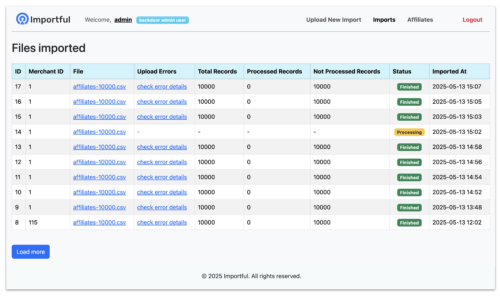
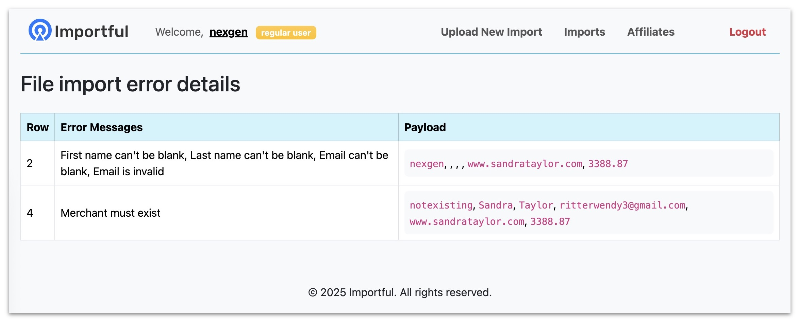

## 

This is a small fun playground Ruby on Rails app to manage affiliate data for merchants. 

The app allows you to:

- **Sign Up** and **Sign In** with merchants.
- **Upload CSV Files** containing affiliate data, for specific merchant.
- **Upload CSV Files** containing affiliate data, for any merchant (if you login as backdoor admin merchant)
- **Transform and Store** the uploaded data into the database.
- **Show upload to server progress** - show progress of uploaded file to a server 
- **Show upload errors** - show errors if there file formatting errors
- **Show error details progress** - for each row in case there are errors during csv processing after uploading
- **Inline editing** - for merchant username/slug
- **Tests coverage** - added tests for the features of the app, with high test coverage
- Show affiliates list for specific merchant (or for backdoor admin show them all)
- Show all imports list for specific merchant (or for backdoor admin show them all)

The initial task for this app can be found [here](TASK.md).

    

    

    

### Example CSV File

You can find an example CSV files in examples folder.