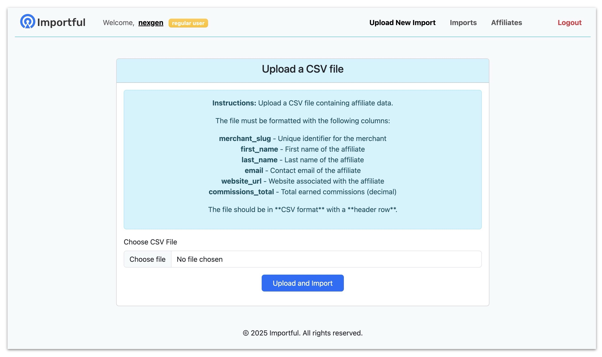

## 

This is a small fun playground Ruby on Rails app to manage affiliate data for merchants. 

The app allows you to:

- **Sign Up** and **Sign In** with merchants.
- **Upload CSV Files** containing affiliate data, for specific merchant.
- **Upload CSV Files** containing affiliate data, for any merchant (if you login as backdoor admin merchant)
- **Transform and Store** the uploaded data into the database.
- **Show upload to server progress** - show progress of uploaded file to a server 
- **Show error details progress** - in case there are errors during csv processing after uploading
- **Inline editing** - for merchant username/slug
- Show affiliates list for specific merchant (or for backdoor admin show them all)
- Show all imports list for specific merchant (or for backdoor admin show them all)

The app processes the uploaded CSV files, validates the data, and stores it in a structured format for further use.
To play with this task, active storage, hotwire (stimulus, turbo frame/stream) were used. 

The initial task for this app can be found [here](TASK.md).

### Example CSV File

You can find an example CSV file [here](examples/affiliates-small.csv).